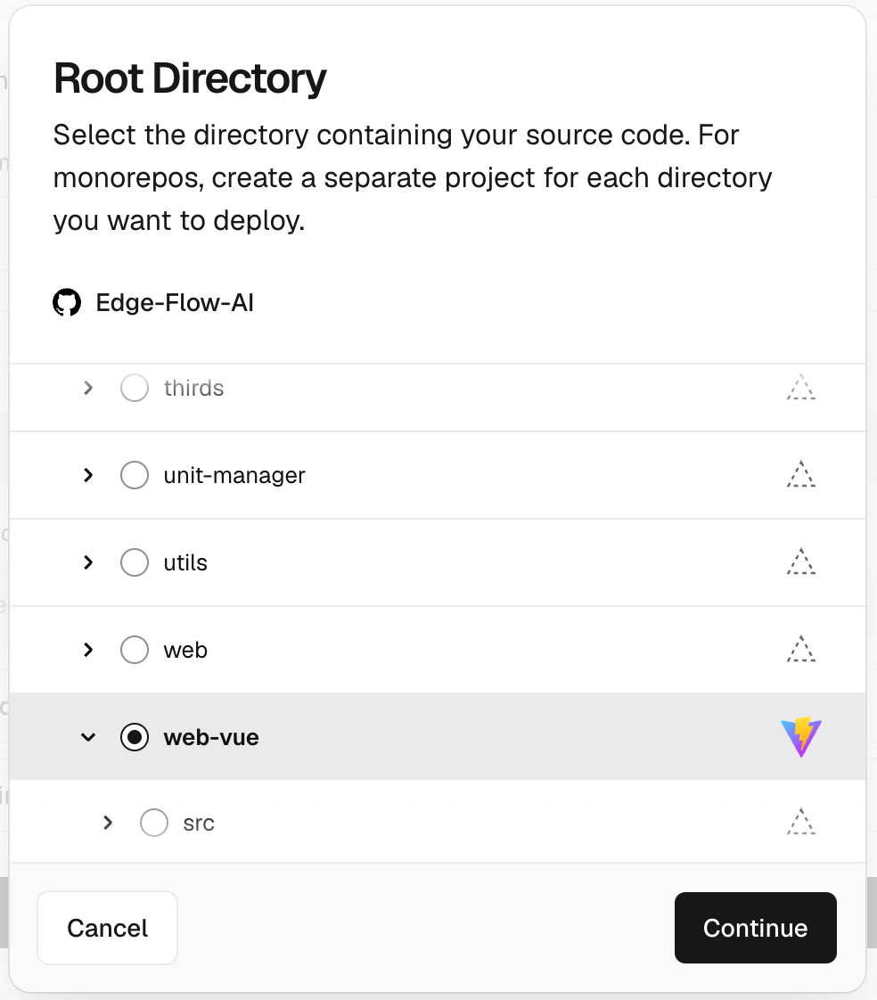
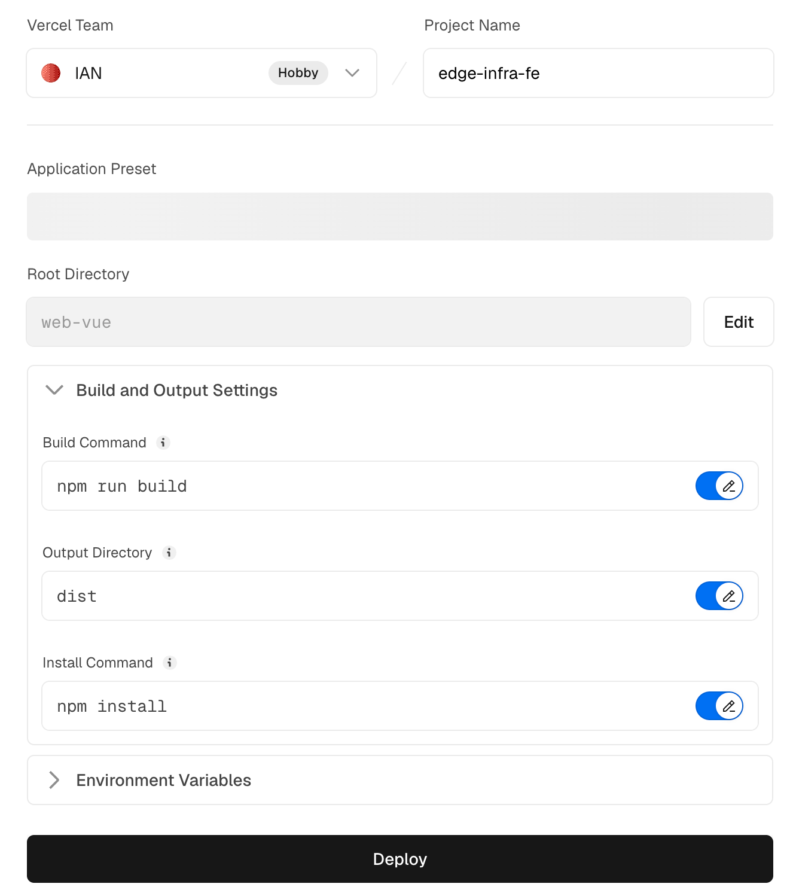
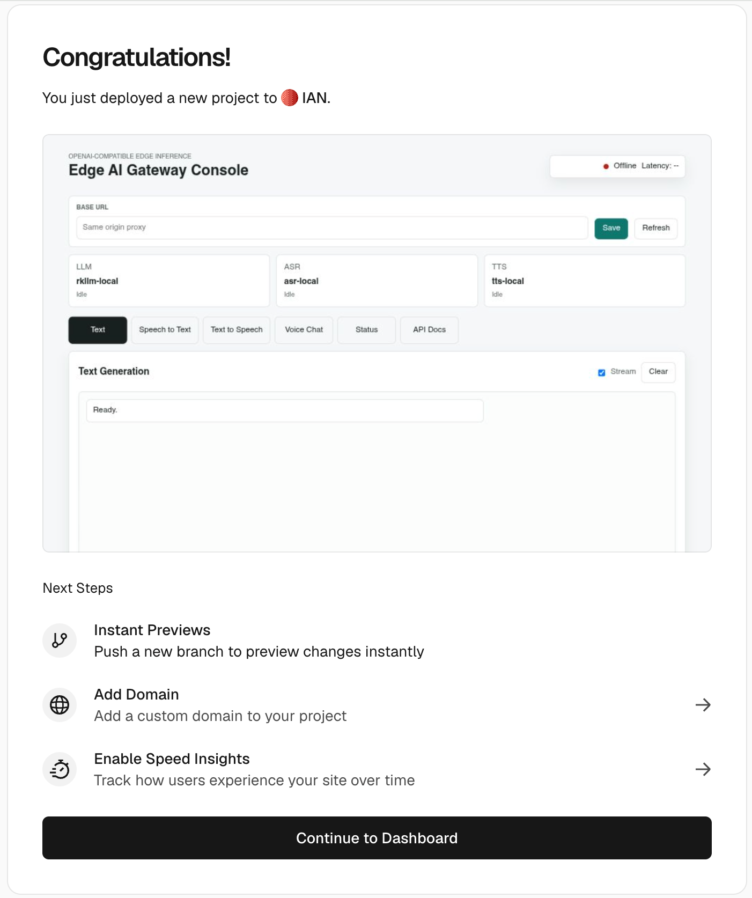
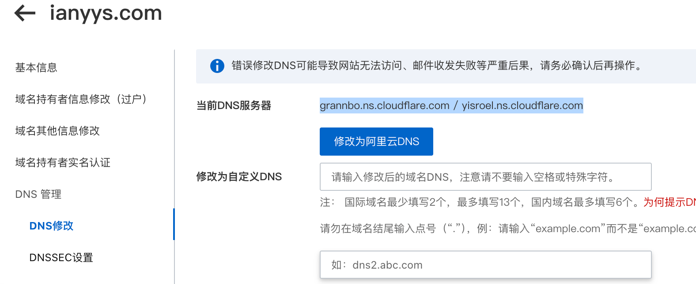
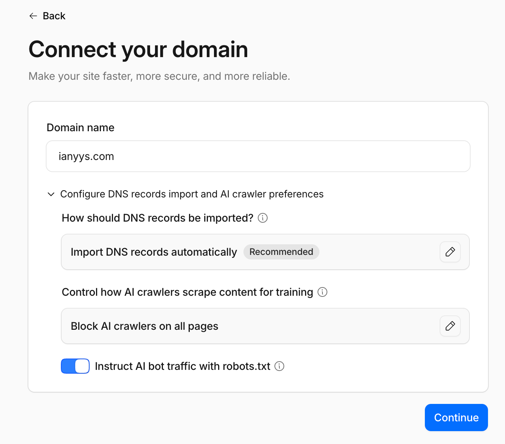
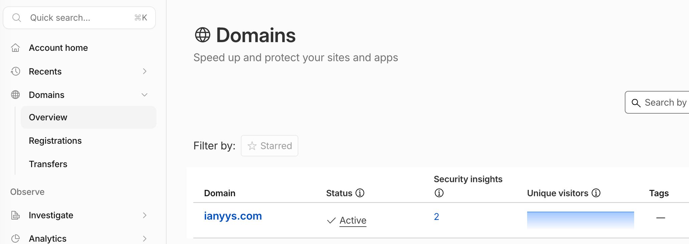
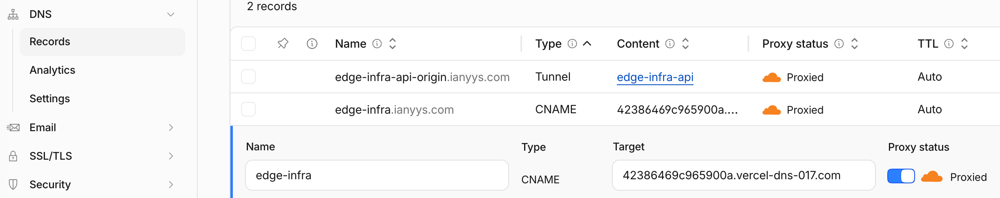
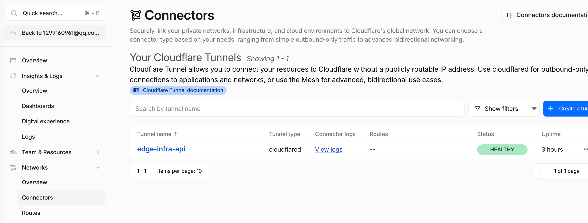
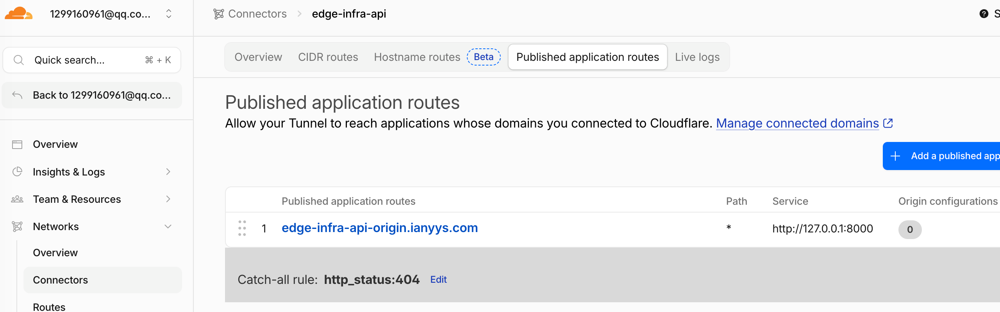

# Edge Flow Infra 前后端公网部署教程

本文档记录 `Edge-Flow-Infra` 项目从“只部署前端到 Vercel”，到“通过 Cloudflare 连接本地后端并统一入口访问”的完整流程。

文档基于当前项目结构和已经使用过的真实配置编写。敏感凭据，例如 Cloudflare Tunnel token、API key、GitHub OAuth secret，不应写入仓库；如果这些内容曾出现在截图或终端里，建议立即轮换。

## 1. 目标架构

最终用户访问一个入口：

```text
https://edge-infra.ianyys.com
```

请求链路：

```text
用户浏览器
  -> Cloudflare Access，GitHub 登录和访问控制
  -> Cloudflare Worker，按路径分流
      /health、/v1/* -> Cloudflare Tunnel -> 本地 FastAPI gateway:8000
      其他路径       -> Vercel 前端
  -> 本地 unit-manager:10001
  -> 本地 rkllm/asr/tts 节点
```

关键域名和服务：

```text
主入口域名:      edge-infra.ianyys.com
前端源站域名:    https://edge-flow-ai.vercel.app
后端 Tunnel 域名: edge-infra-api-origin.ianyys.com
本地后端端口:    127.0.0.1:8000
内部控制端口:    127.0.0.1:10001
```

注意：`unit-manager:10001` 只允许本机或内网访问，不能暴露到互联网。公网只应该通过 FastAPI gateway 的 `8000` 端口进入。

## 2. 项目结构

和部署相关的目录：

```text
web-vue/                  Vue 3 + Vite 前端
gateway/                  FastAPI OpenAI-compatible 网关
scripts/                  本地运行时启动、停止、状态脚本
cloudflare/               Cloudflare Worker 路由配置
```

前端构建配置：

```text
web-vue/package.json
```

关键脚本：

```json
{
  "dev": "vite --host 0.0.0.0 --port 8080",
  "build": "vite build",
  "preview": "vite preview --host 0.0.0.0 --port 8080"
}
```

后端启动方式：

```bash
cd /home/pi/Edge-Flow-Infra
./scripts/start_runtime.sh
```

这个脚本会启动：

```text
unit-manager/build/unit_manager
node/llm/build/rkllm_node
node/tts/build/tts_node
node/asr/build/asr_node
python3 -m uvicorn gateway.app.main:app
```

## 3. 第一阶段：单独把前端部署到 Vercel

### 3.1 本地构建验证

先在本地确认前端可以构建：

```bash
cd /home/pi/Edge-Flow-Infra/web-vue
npm install
npm run build
```

构建产物目录：

```text
/home/pi/Edge-Flow-Infra/web-vue/dist
```

作用：确认前端代码没有构建错误。Vercel 部署时本质上也是执行 `npm run build`，然后发布 `dist/`。

### 3.2 推送代码到 GitHub

Vercel 通常通过 GitHub 仓库自动部署，所以需要把 `web-vue/` 提交并推送到 GitHub。

注意当前仓库里 `web-vue/` 曾经是未跟踪目录，部署前要确认它已经提交：

```bash
git status --short
```

### 3.3 在 Vercel 创建项目

进入 Vercel：

```text
Vercel Dashboard -> Add New -> Project -> Import Git Repository
```

项目设置：

```text
Framework Preset: Vite
Root Directory: web-vue
Install Command: npm install
Build Command: npm run build
Output Directory: dist
```

作用：只部署前端静态资源，不部署 Python/FastAPI 后端。


### 3.4 Vercel 环境变量

如果后端暂时没有公网地址，可以先不设置 API 地址。前端页面支持在 UI 里填写 `Base URL`。

同源 Worker 方案下，推荐不要设置：

```text
VITE_GATEWAY_BASE_URL
```

或者设置为空。

这样前端会默认请求当前域名下的：

```text
/health
/v1/chat/completions
/v1/audio/speech
/v1/audio/transcriptions
/v1/audio/conversations
```

作用：后续让 Cloudflare Worker 把同源 `/v1/*` 和 `/health` 转发到后端，避免浏览器跨域复杂度。




## 4. 域名 DNS：登录阿里云域名控制台，从阿里云切到 Cloudflare

域名：

```text
ianyys.com
```

阿里云原 NS：

```text
dns21.hichina.com
dns22.hichina.com
```

Cloudflare 分配的 NS：

```text
grannbo.ns.cloudflare.com
yisroel.ns.cloudflare.com
```

修改后通常几分钟 ~ 2小时生效，偶尔24小时。Cloudflare 后台会显示：Pending，验证成功后会变成：Active。

这时说明：ianyys.com已经正式接入 Cloudflare



### 4.1 在 Cloudflare 添加站点
先把你的域名 ianyys.com 加到 Cloudflare 里，让 Cloudflare 接管这个域名的 DNS 管理。

可以理解为：你告诉 Cloudflare——“我要让你来管理 ianyys.com 这个域名”。
进入：

```text
Cloudflare Dashboard -> Domains -> Add domain -> Connect a domain
```

添加：

```text
ianyys.com
```

Cloudflare 会扫描现有 DNS 记录，并给出需要在注册商处设置的 nameserver。


### 4.2 在阿里云修改 nameserver

进入阿里云域名控制台，把域名 `ianyys.com` 的 DNS 服务器从：

```text
dns21.hichina.com
dns22.hichina.com
```

改为：

```text
grannbo.ns.cloudflare.com
yisroel.ns.cloudflare.com
```

作用：让 Cloudflare 接管 `ianyys.com` 的 DNS。只有接管后，Cloudflare 的 DNS、Access、Tunnel、Worker 才能完整作用在该域名上。

### 4.3 等待生效

等待 DNS 传播，Cloudflare 里站点状态应变为 Active。

可以检查：

```bash
dig NS ianyys.com
```

期望看到：

```text
grannbo.ns.cloudflare.com
yisroel.ns.cloudflare.com
```


## 5. Cloudflare DNS 记录

在 Cloudflare 里给你的主访问域名 edge-infra.ianyys.com 添加 DNS 解析记录，让用户访问这个域名时先进入 Cloudflare，然后再由 Cloudflare Worker 决定请求去哪。

进入：

```text
Cloudflare Dashboard -> Domains -> ianyys.com -> DNS -> Records
```

### 5.1 主入口域名

主入口：

```text
edge-infra.ianyys.com
```

添加或确认这条记录：

```text
Type: CNAME，表示这个子域名指向另一个域名。
Name: edge-infra，最终完整域名就是：edge-infra.ianyys.com
Target: edge-flow-ai.vercel.app，让 edge-infra.ianyys.com 指向 Vercel
Proxy status: Proxied，橙色云，流量会先进入 Cloudflare，这样 Worker 才能拦截请求
```

作用：让 `edge-infra.ianyys.com` 流量先进 Cloudflare。之后 Worker Route 会拦截这个 hostname，并按路径转发到 Vercel 或后端。



### 5.2 Vercel 源站域名

用于 Worker 拉取前端页面的源站，例如：

```text
edge-infra.console.ianyys.com
```

它应该指向 Vercel 前端，并且不要配置 Worker route 到它。

也可以直接使用 Vercel 默认地址：

```text
https://<vercel-project>.vercel.app
```

作用：Worker 处理 `edge-infra.ianyys.com` 时，需要一个不会回到自己的前端源站。

### 5.3 后端 Tunnel 域名

后端 origin：后端运行在3588上，但机器在家庭网络或校园网里，公网无法直接访问。

所以用 Cloudflare Tunnel，把本地服务暴露出去：

```text
edge-infra-api-origin.ianyys.com

外网访问：
https://edge-infra-api-origin.ianyys.com

Cloudflare Tunnel 转发到：
http://localhost:8000
```

这条通常由 Cloudflare Tunnel 的 Published application route 自动创建或管理。不要再手动创建冲突 DNS 记录。

Tunnel 生成 DNS 记录，是为了把一个公网域名绑定到这条 Tunnel 上，让外部请求能够通过这个域名进入你的本地后端服务



去 Tunnel 的 Public Hostnames 里添加 edge-infra-api-origin.ianyys.com -> http://localhost:8000



Service: http://127.0.0.1:8000
表示 Tunnel 连接到你运行 cloudflared 的那台机器上的本地服务。所以 FastAPI 应该在那台机器上运行，例如：
```text
uvicorn main:app --host 127.0.0.1 --port 8000
```

### 5.4 完整分流
```text
1. DNS 记录：edge-infra.ianyys.com 指向 Vercel，橙色云
2. Worker 代码：判断路径转发到前端或后端
3. Worker Route：edge-infra.ianyys.com/* 绑定到这个 Worker
4. 后端 API 域名：edge-infra-api-origin.ianyys.com 可访问你的 FastAPI
```

## 6. 后端代码开发工作

### 6.1 收紧 CORS

文件：

```text
gateway/app/main.py
```

已改为默认只允许：

```text
https://edge-infra.ianyys.com
```

代码：

```python
CORS_ALLOW_ORIGINS = os.getenv(
    "CORS_ALLOW_ORIGINS",
    "https://edge-infra.ianyys.com",
).split(",")

app.add_middleware(
    CORSMiddleware,
    allow_origins=CORS_ALLOW_ORIGINS,
    allow_credentials=True,
    allow_methods=["*"],
    allow_headers=["*"],
)
```

作用：避免任意网页都能从浏览器直接调用后端。即便使用同源 Worker，浏览器请求里仍可能携带 `Origin: https://edge-infra.ianyys.com`，后端应该只允许这个来源。

生产运行时也可以显式设置：

```bash
export CORS_ALLOW_ORIGINS=https://edge-infra.ianyys.com
```

### 6.2 Cloudflare Worker 路由代码

文件：

```text
cloudflare/edge-infra-worker.js
```

推荐内容：

```js
const FRONTEND_ORIGIN = "https://edge-flow-infra.vercel.app";
const API_ORIGIN = "https://edge-infra-api-origin.ianyys.com";

const API_PATHS = ["/health", "/v1/"];

export default {
  async fetch(request) {
    const url = new URL(request.url);
    const targetOrigin = isApiPath(url.pathname) ? API_ORIGIN : FRONTEND_ORIGIN;
    const targetUrl = new URL(request.url);
    const target = new URL(targetOrigin);

    targetUrl.protocol = target.protocol;
    targetUrl.hostname = target.hostname;
    targetUrl.port = target.port;

    return fetch(new Request(targetUrl, request));
  },
};

function isApiPath(pathname) {
  return API_PATHS.some((path) => {
    if (path.endsWith("/")) {
      return pathname.startsWith(path);
    }
    return pathname === path;
  });
}
```

作用：

```text
https://edge-infra.ianyys.com/health -> https://edge-infra-api-origin.ianyys.com/health
https://edge-infra.ianyys.com/v1/*   -> https://edge-infra-api-origin.ianyys.com/v1/*
https://edge-infra.ianyys.com/*      -> https://edge-infra.console.ianyys.com/*
```

禁止把 `FRONTEND_ORIGIN` 写成：

```js
const FRONTEND_ORIGIN = "https://edge-infra.ianyys.com";
```

因为这会导致 Worker 请求自己。

## 7. 启动本地后端

### 7.0 构建本地后端
```bash
# 打镜像
docker build --no-cache -f docker/build/base.dockerfile -t llm:v1.0 docker/build

bash docker/scripts/llm_docker_run.sh
bash docker/scripts/llm_docker_into.sh

# 编译
cd /home/pi/Edge-Flow-Infra

# infra-controller  -> 生成 install/lib/libstackflow.a
cmake -S infra-controller -B infra-controller/build
cmake --build infra-controller/build -j$(nproc)
cmake --install infra-controller/build

# unit-manager      -> 调度入口，监听 10001
cmake -S unit-manager -B unit-manager/build
cmake --build unit-manager/build -j$(nproc)

# node/llm          -> RKLLM 推理节点
cmake -S node/llm -B node/llm/build
cmake --build node/llm/build -j$(nproc)

cmake -S node/asr -B node/asr/build
cmake --build node/asr/build -j$(nproc)

cmake -S node/tts -B node/tts/build
cmake --build node/tts/build -j$(nproc)

# gateway           -> Python 服务，不需要编译
```

gateway 在边缘设备或服务器上：

```bash
cd /home/pi/Edge-Flow-Infra
./scripts/start_runtime.sh
```

检查状态：

```bash
./scripts/status_runtime.sh
```

本地验证：

```bash
curl -i http://127.0.0.1:8000/health
```

期望返回：

```http
HTTP/1.1 200 OK
```

示例 JSON：

```json
{
  "status": "ok",
  "unit_manager": {
    "host": "127.0.0.1",
    "port": 10001
  },
  "rkllm": {
    "model": "rkllm-local",
    "busy": false
  },
  "tts": {
    "model": "tts-local",
    "busy": false
  },
  "asr": {
    "model": "asr-local",
    "busy": false
  }
}
```

作用：先证明后端本机可用，再排查 Cloudflare。公网 502 时，必须先确认这一步是通的。

## 8. Cloudflare Tunnel 配置后端

进入：

```text
Cloudflare Dashboard -> Zero Trust -> Networks -> Connectors
```

当前 Tunnel 信息：

```text
Tunnel name: edge-infra-api
Tunnel type: cloudflared
Tunnel ID: cf53f051-d614-4922-af8e-aeb7819bd257
Connector ID: f67607f6-13fb-41c9-91f7-723f8d213ef4
Connector hostname: 661f82c10b82
Data center: lax
Origin IP: 221.221.236.52
Version: 2026.6.1
Platform: linux_arm64
Status: Connected / Healthy
```

### 8.1 创建 Tunnel

路径：

```text
Zero Trust -> Networks -> Connectors -> Create a tunnel
```

选择：

```text
cloudflared
```

名称：

```text
edge-infra-api-origin
```

Cloudflare 会给出运行命令，例如：

```bash
docker run cloudflare/cloudflared:latest tunnel --no-autoupdate run --token <CLOUDFLARE_TUNNEL_TOKEN>
```

不要把 `<CLOUDFLARE_TUNNEL_TOKEN>` 写入仓库。该 token 如果曾经在截图中暴露，建议删除旧 connector 或轮换 token。

### 8.2 Published application route

进入 Tunnel：

```text
edge-infra-api -> Published application routes
```

新增或编辑：

```text
Published application route: edge-infra-api-origin.ianyys.com
Path: *
Service: http://127.0.0.1:8000
Origin configurations: 0
```

等价字段：

```text
Subdomain: edge-infra-api-origin
Domain: ianyys.com
Path: 留空或 *
Service type: HTTP
Service URL: 127.0.0.1:8000
```

作用：让公网 `https://edge-infra-api-origin.ianyys.com` 通过 Tunnel 转发到本地 FastAPI gateway。

不要填：

```text
https://127.0.0.1:8000
127.0.0.1:10001
edge-infra-api-origin.ianyys.com
```

### 8.3 Docker 运行 cloudflared 时的注意事项

如果使用：

```bash
docker run cloudflare/cloudflared:latest tunnel --no-autoupdate run --token <TOKEN>
```

那么默认情况下 `127.0.0.1` 指的是 cloudflared 容器内部，不是宿主机。Cloudflare 页面里填：

```text
http://127.0.0.1:8000
```

可能会 502。

推荐用 host 网络：

```bash
docker run --rm --network host cloudflare/cloudflared:latest tunnel --no-autoupdate run --token <CLOUDFLARE_TUNNEL_TOKEN>
```

这样 cloudflared 容器里的 `127.0.0.1:8000` 就是宿主机的 `127.0.0.1:8000`。

另一种方法是把 Service URL 改成宿主机局域网 IP：

```text
http://<服务器局域网IP>:8000
```

验证宿主机 IP：

```bash
hostname -I
curl http://<服务器局域网IP>:8000/health
```

### 8.4 不要使用 Hostname routes 做公网发布

Cloudflare 新 UI 里有：

```text
Hostname routes
```

该页面会提示：

```text
This configuration requires traffic to pass via Cloudflare Gateway.
Users need the Cloudflare One Client...
```

这不是公网浏览器访问用的配置。公网后端应配置在：

```text
Published application routes
```

作用差异：

```text
Published application routes: 公网域名 -> Tunnel -> 本地服务
Hostname routes: WARP/Cloudflare One Client 私有网络访问
```

## 9. Cloudflare Worker 配置

### 9.1 创建 Worker

路径：

```text
Cloudflare Dashboard -> Compute -> Workers & Pages -> Create application -> Create Worker
```

Worker 名称：

```text
edge-infra-router
```

复制 `cloudflare/edge-infra-worker.js` 的内容。

### 9.2 绑定 Route

路径：

```text
Workers & Pages -> edge-infra-router -> Settings -> Domains & Routes -> Add route
```

配置：所有访问 edge-infra.ianyys.com 的请求，都先交给 Worker 处理

```text
Route: edge-infra.ianyys.com/*
Zone: ianyys.com
```

例如：

```text
https://edge-infra.ianyys.com/
https://edge-infra.ianyys.com/about
https://edge-infra.ianyys.com/v1/chat
https://edge-infra.ianyys.com/health
```

作用：让所有访问 `edge-infra.ianyys.com` 的请求先进入 Worker，再由 Worker 分发到前端或后端。

## 10. Cloudflare Access 配置 GitHub 登录

进入：

```text
Cloudflare Dashboard -> Zero Trust -> Access controls -> Applications
```

创建应用：

```text
Add an application -> Self-hosted and private -> Workers
```

或在新 UI 中选择与 Worker 相关的目标。

应用配置：

```text
Application name: edge-infra
Application domain: edge-infra.ianyys.com
```

作用：保护统一入口。用户访问 `https://edge-infra.ianyys.com` 时先经过 Cloudflare Access。

### 10.1 GitHub 登录

路径：

```text
Zero Trust -> Settings -> Authentication -> Login methods -> Add new -> GitHub
```

作用：让用户使用 GitHub 身份登录。

### 10.2 只允许指定用户

策略：

```text
Action: Allow
Include: Emails
Value: 1299160961@qq.com
```

作用：只有该用户可以通过 Access 进入网站。

### 10.3 允许所有完成登录的用户

策略：

```text
Action: Allow
Include: Everyone
```

含义：所有能完成 Cloudflare Access 登录的用户都可以访问。如果只启用了 GitHub 登录方式，则所有能用 GitHub 登录并通过 Access 的用户都可以进入。

注意：这不是“完全公开”。用户仍需要登录。

### 10.4 完全公开，不需要登录

策略：

```text
Action: Bypass
Include: Everyone
```

或者删除/禁用 Access Application。

不建议这么做。这个项目的后端会真实占用本地 LLM、ASR、TTS 资源，完全公开容易被刷爆。

## 11. Vercel 前端和 Cloudflare 的管理关系

### 11.1 Vercel 负责什么

Vercel 负责：

```text
构建 web-vue/
托管 dist/
提供前端源站
```

Vercel 项目配置：

```text
Root Directory: web-vue
Build Command: npm run build
Output Directory: dist
Install Command: npm install
```

### 11.2 Cloudflare 负责什么

Cloudflare 负责：

```text
DNS 托管 ianyys.com
Access GitHub 登录
Tunnel 连接本地后端
Worker 同源分流
HTTPS 入口
访问日志和部分安全策略
```

### 11.3 前端 Base URL

同源 Worker 方案下，前端页面里的 Base URL 应留空。

请求路径：

```text
/health
/v1/chat/completions
/v1/audio/speech
/v1/audio/transcriptions
/v1/audio/conversations
```

Worker 会把这些 API 路径转发到：

```text
https://edge-infra-api-origin.ianyys.com
```

其他页面请求转发到 Vercel 前端源站。

## 12. 验证顺序

按这个顺序排查最省时间。

### 12.1 验证本地后端

```bash
curl -i http://127.0.0.1:8000/health
```

必须返回 `200 OK`。

如果不通，先启动：

```bash
cd /home/pi/Edge-Flow-Infra
./scripts/start_runtime.sh
```

### 12.2 验证 Tunnel 后端域名

```bash
curl -i https://edge-infra-api-origin.ianyys.com/health
```

必须返回后端 JSON。

如果返回：

```text
Bad gateway
Error code 502
Host Error
```

说明 Cloudflare 已收到请求，但 Tunnel 到 origin 的转发失败。重点检查：

```text
Tunnel 是否 Healthy
Published application route 是否存在
Service 是否是 HTTP
Service URL 是否能被 cloudflared 所在环境访问
Docker cloudflared 是否需要 --network host
```

### 12.3 验证 Worker 同源 API

```bash
curl -i https://edge-infra.ianyys.com/health
```

如果 Access 开启，未登录时可能返回 302 到 Cloudflare Access 登录页，这是正常的。

登录后，浏览器访问：

```text
https://edge-infra.ianyys.com/health
```

应返回后端 JSON。

### 12.4 验证前端

打开：

```text
https://edge-infra.ianyys.com
```

流程：

```text
Cloudflare Access GitHub 登录
-> Worker 转发页面请求到 Vercel
-> 前端加载
-> 前端请求 /health 和 /v1/*
-> Worker 转发 API 到 Tunnel 后端
```

## 13. 日志和访问记录

### 13.1 Cloudflare Access 登录日志

路径：

```text
Zero Trust -> Insights & Logs -> Logs -> Access
```

可以看到：

```text
用户邮箱
访问应用
Allow / Deny
IP
国家地区
匹配策略
```

作用：确认谁登录过网站。

### 13.2 Cloudflare Tunnel Live logs

路径：

```text
Zero Trust -> Networks -> Connectors -> edge-infra-api -> Live logs
```

作用：排查 Tunnel 是否收到请求、是否转发失败、是否出现 502。

### 13.3 本地 gateway 日志

```bash
cd /home/pi/Edge-Flow-Infra
tail -f runtime/logs/gateway.log
```

查看最近日志：

```bash
tail -n 100 runtime/logs/gateway.log
```

作用：确认后端是否实际收到 `/health`、`/v1/chat/completions`、`/v1/audio/*` 请求。

### 13.4 Vercel Analytics

路径：

```text
Vercel -> Project -> Analytics
```

作用：看前端页面访问量、页面路径、地区等。它通常不能直接告诉你 GitHub 用户身份，身份日志应看 Cloudflare Access。

## 14. 常见问题

### 14.1 为什么 `edge-infra-api-origin.ianyys.com/health` 是 502

含义：

```text
Browser: Working
Cloudflare: Working
Host: Error
```

说明 Cloudflare 已经接到请求，但后端 origin 没有正常响应。

常见原因：

```text
FastAPI gateway 没启动
Tunnel route 没配置到 8000
Service Type 误选 HTTPS
Service URL 填成 10001
cloudflared 在 Docker 里，127.0.0.1 指向容器
```

修复优先级：

```text
1. curl http://127.0.0.1:8000/health
2. 检查 Published application routes
3. Docker cloudflared 改用 --network host
4. curl https://edge-infra-api-origin.ianyys.com/health
```

### 14.2 为什么不要暴露 `unit-manager:10001`

`unit-manager` 是内部控制面，不是公网 API。它直接调度本地 LLM、ASR、TTS 节点，通常没有面向公网的认证、限流、错误隔离。

正确边界：

```text
公网
  -> Cloudflare
  -> FastAPI gateway:8000
  -> unit-manager:10001
  -> rkllm/asr/tts
```

### 14.3 为什么 Worker 不能把前端源站写成 `edge-infra.ianyys.com`

因为 Worker route 就绑定在：

```text
edge-infra.ianyys.com/*
```

如果 Worker 再 fetch：

```text
https://edge-infra.ianyys.com
```

请求会再次进入同一个 Worker，形成循环。

应使用：

```text
https://edge-infra.console.ianyys.com
```

或 Vercel 默认：

```text
https://<vercel-project>.vercel.app
```

### 14.4 `Allow + Everyone` 是完全公开吗

不是。

```text
Action: Allow
Include: Everyone
```

表示所有通过 Cloudflare Access 登录的人都能访问。如果登录方式是 GitHub，就表示所有能完成 GitHub 登录的人都能进。

完全公开是：

```text
Action: Bypass
Include: Everyone
```

完全公开不建议用于本项目。

## 15. 安全建议

最低要求：

```text
Cloudflare Access 保护 edge-infra.ianyys.com
CORS_ALLOW_ORIGINS=https://edge-infra.ianyys.com
公网不暴露 10001
公网不直接暴露模型节点端口
Tunnel token 不进仓库
```

强烈建议继续做：

```text
后端增加 API Key 或内部 Header 校验
Worker 给 API 请求注入内部密钥
后端限制请求大小，尤其音频上传
后端增加简单限流
/health 公网只返回简单状态，详细状态放到鉴权接口
记录 Cloudflare Access 用户邮箱和 API 路径
```

如果需要让 Worker 注入内部密钥，思路：

```text
Cloudflare Worker Secret: EDGE_GATEWAY_INTERNAL_KEY
Worker 转发 /v1/* 时添加 X-Edge-Gateway-Key
FastAPI gateway 校验 X-Edge-Gateway-Key
```

这样用户浏览器看不到密钥，即使知道 API origin，也不能直接绕过 Worker 调用后端。

## 16. 当前已知真实值汇总

```text
域名: ianyys.com
阿里云原 NS: dns21.hichina.com, dns22.hichina.com
Cloudflare NS: grannbo.ns.cloudflare.com, yisroel.ns.cloudflare.com

主入口: https://edge-infra.ianyys.com
前端源站: https://edge-infra.console.ianyys.com
后端 origin: https://edge-infra-api-origin.ianyys.com

Cloudflare Worker: edge-infra-router
Worker route: edge-infra.ianyys.com/*
Cloudflare zone: ianyys.com

Tunnel name: edge-infra-api
Tunnel ID: cf53f051-d614-4922-af8e-aeb7819bd257
Connector ID: f67607f6-13fb-41c9-91f7-723f8d213ef4
Connector hostname: 661f82c10b82
Connector version: 2026.6.1
Connector platform: linux_arm64
Connector data center: lax
Origin IP shown by Cloudflare: 221.221.236.52

Tunnel published route: edge-infra-api-origin.ianyys.com
Tunnel service: http://127.0.0.1:8000
Local gateway: http://127.0.0.1:8000
Internal unit-manager: 127.0.0.1:10001

CORS allowed origin: https://edge-infra.ianyys.com
```

## 17. 最终检查清单

上线前确认：

```text
[ ] 阿里云 nameserver 已切到 Cloudflare NS
[ ] Cloudflare zone ianyys.com 已 Active
[ ] Vercel 前端 web-vue 构建成功
[ ] edge-infra.console.ianyys.com 或 Vercel 默认 URL 能访问前端
[ ] gateway 本地 curl http://127.0.0.1:8000/health 返回 200
[ ] Cloudflare Tunnel edge-infra-api 为 Healthy
[ ] Published application route 指向 http://127.0.0.1:8000
[ ] 如果 cloudflared 用 Docker，已使用 --network host 或改用宿主机 IP
[ ] https://edge-infra-api-origin.ianyys.com/health 返回后端 JSON
[ ] Worker route edge-infra.ianyys.com/* 已部署
[ ] Worker FRONTEND_ORIGIN 没有写成 edge-infra.ianyys.com
[ ] Cloudflare Access 应用保护 edge-infra.ianyys.com
[ ] Access Policy 符合预期：指定用户、所有登录用户或 Bypass
[ ] Vercel 的 VITE_GATEWAY_BASE_URL 为空或未设置
[ ] 前端 Base URL 留空
[ ] https://edge-infra.ianyys.com 登录后能打开页面
[ ] https://edge-infra.ianyys.com/health 登录后返回后端 JSON
[ ] Chat / ASR / TTS / Voice Chat 功能正常
```

